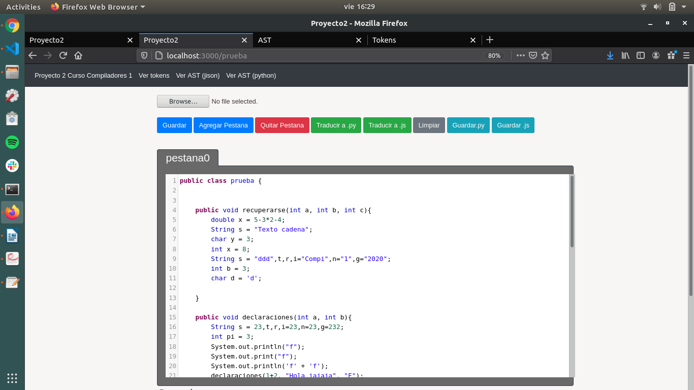
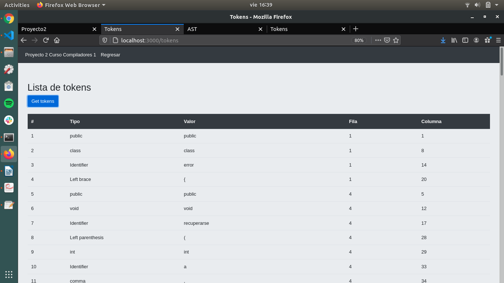
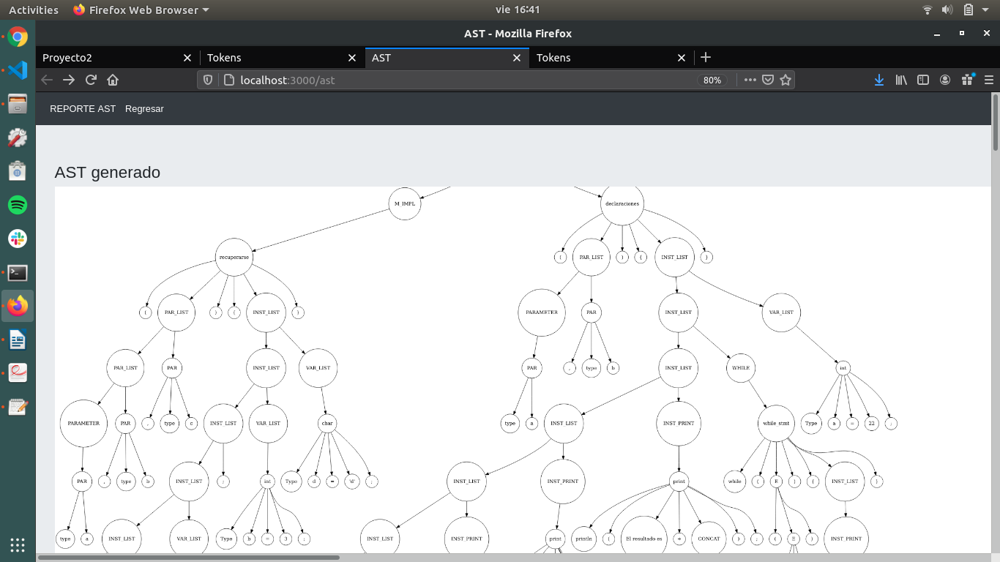
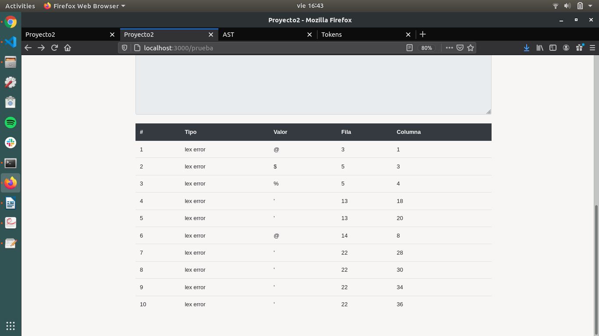

<!-- Header --->
# MANUAL USUARIO

## Proyecto 2 Curso organización de lenguajes y compiladores 1, Segundo semestre 2020

### Juan Antonio Solares Samayoa - Carne 201800496 
*Escuela de Ciencias y Sistemas USAC.*

***

## DESCRIPCION DE LA APLICACIÓN

Esta aplicación consiste en un traductor de codigo del lenguaje de programacion *java* a su codigo equivalente en lenguaje *python* y *javascript*

# INTERFAZ DE LA APLICACIÓN




## FUNCIONES DE LA APLICACION

Partes de la aplicacion

La aplicación tiene las siguientes funciones basicas:

* Abrir archivo
* Abrir y cerrar pestañas del editor de codigo
* Boton analizar y traducir codigo *java* a *python*
* Boton analizar y traducir codigo *java* a *javascript*


#### Traductor *java* a *python*
* Analizador lexico sin herramienta 
* Analizador sintactico sin herramienta con recuperación de errores en modo pánico
* Traductor de codigo *java* a codigo *python*

#### Traductor *java* a *javascript*
* Analizador lexico con herramienta jison
* Analizador sintactico con herramienta jison
* Recuperación de errores en modo panico
* Traductor de codigo *java* a codigo *javascript*

#### Requisitos para ejecutar la aplicación

* Instalar node js
* Instalar jison
 ``` 
 npm install jison -g  
 ```
* Compilar el archivo de jison

 ``` 
 jison "nombre_archivo".jison
 ```


## OTRAS FUNCIONALIDADES

### REPORTES

* #### Reporte de tokens obtenidos



* #### Reporte de AST 



* #### Reporte de errores lexicos



* #### Reporte de errores sintácticos
 
 
